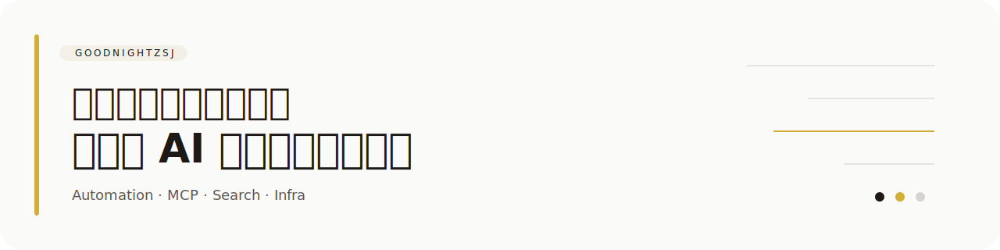

  

> 主要做自动化、代理链路、AI 工作流，也会写一些偏实用的小工具。

把浏览器自动化、搜索链路、代理能力和模型工作流串起来，做成能长期复用的小系统。

## 项目精选

- [codex-session-cloner](https://github.com/goodnightzsj/codex-session-cloner)  
  在不同编码助手之间迁移历史对话的小工具。

- [pt-invite-watcher](https://github.com/goodnightzsj/pt-invite-watcher)  
  基于 mp 与 CookieCloud 的开邀监控工具。

- [move_and_add_torrent](https://github.com/goodnightzsj/move_and_add_torrent)  
  自动整理影视文件并接入种子处理流程。

- [auto_download_torrent](https://github.com/goodnightzsj/auto_download_torrent)  
  批量抓取并下载 NexusPHP 站点种子列表。

- [books-manag-system](https://github.com/goodnightzsj/books-manag-system)  
  一个简洁的图书管理系统练手项目。

- [MySearch-Proxy](https://github.com/goodnightzsj/MySearch-Proxy)  
  统一搜索 MCP 与代理控制台，整合 Tavily、Firecrawl 和 X。

- [temp-mail-console](https://github.com/goodnightzsj/temp-mail-console)  
  基于 Cloudflare Workers + D1 的临时邮箱控制台与规则提取系统。

## 关注方向

- AI 工作流与自动化
- 浏览器控制与 MCP 集成
- 搜索、邮箱、代理与数据通路

更多项目可以直接看我的 Repositories。
